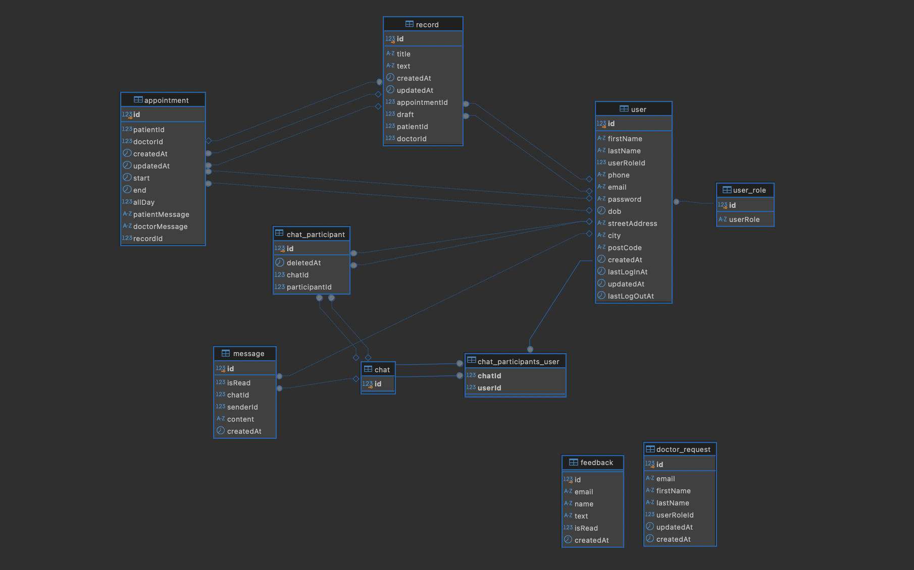

### Introduction

This repository contains a back end for a personal portfolio project "Health Center".
___


### Table of Contents

- [Introduction](#introduction)
- [Table of Contents](#table-of-contents)
- [Architecture](#architecture)
- [Folder Structure](#folder-structure)
- [Features](#features)
    - [API](#api)
    - [ERD](#erd)
    - [User permissions](#user-permissions)

___

### Architecture

- Node express
- TypeORM
- GraphQL
- SQL
- Docker
- Azure

___

### Folder Structure

```
Root Folder
└── src
    ├── schema.ts
    ├── app.ts
    ├── index.ts
    ├──  / configurations
    │   ├── db.config.ts
    │   └── app.config.ts
    ├──  / services
    │   └── email.service.ts
    ├──  / migration
    └──  / graphql
        ├── query.resolver.ts
        ├── resolvers.ts
        ├── types.ts
        ├── / appointment
        │   ├── appointment.ts
        │   ├── appointment.input.ts
        │   ├── appointment.model.ts
        │   ├── appointment.resolver.ts
        │   └── appointment.mutation.resolver.ts
        ├── / doctor-request
        │   ├── doctor-request.ts
        │   ├── doctor-request.model.ts
        │   └── doctor-request.mutation.resolver.ts
        ├── / record
        │   ├── record.ts
        │   ├── record.input.ts
        │   ├── record.model.ts
        │   ├── record.resolver.ts
        │   └── record.mutation.resolver.ts
        └── / user
            ├── user.ts
            ├── user.input.ts
            ├── user.model.ts
            ├── user-role.model.ts
            ├── user.resolver.ts
            └── user.mutation.resolver.ts
```


___

### Features

- Google authentication
- Nodemailer email service
  

##### API

This backend serves GraphQL API, with SQL database connection.


##### ERD 




##### User permissions


'*' marks operations that trigger email notification. Doctor action send notification to patient; patient action, to doctor.


|entity / user_role|admin |doctor  | patient|
--- | --- | --- | ---|
|user|GET|GET|GET|
||CREATE||CREATE*|
||UPDATE|UPDATE|UPDATE|
||DELETE|DELETE|DELETE|
|doctor_request|GET|||
|||CREATE||
||UPDATE|||
||DELETE|||
|medical_record||GET|GET|
|||CREATE*||
|||UPDATE*||
|||DELETE||
|appointment||GET|GET|
||CREATE||CREATE|
||UPDATE|UPDATE*|UPDATE|
||DELETE|DELETE*|DELETE*|
  